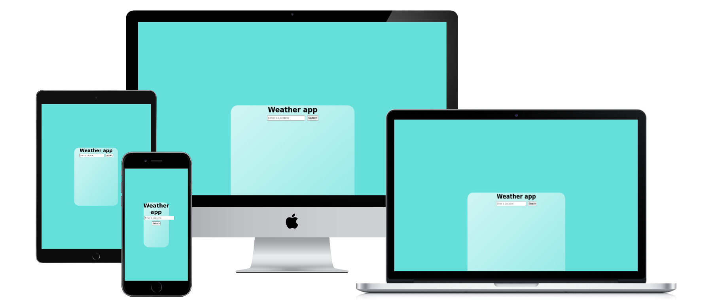

# Weather app

Check it out at [Weather app](https://weather-app-jhalpati.netlify.app/)

As the name suggests, this React app made using Openweathermap's API will allow you to see the current weather of a location; as well as other related details. More features to be added soon.

## Below is a screenshot of the web-app

